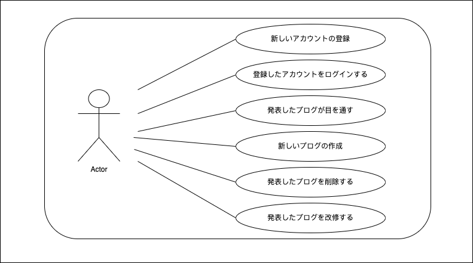
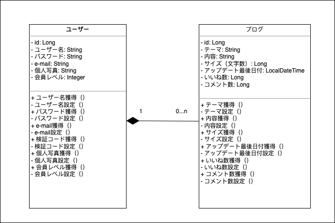
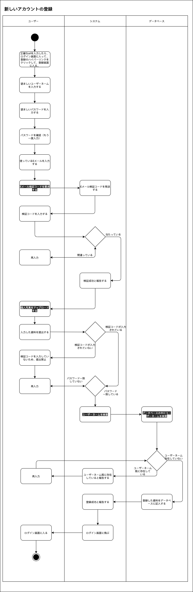
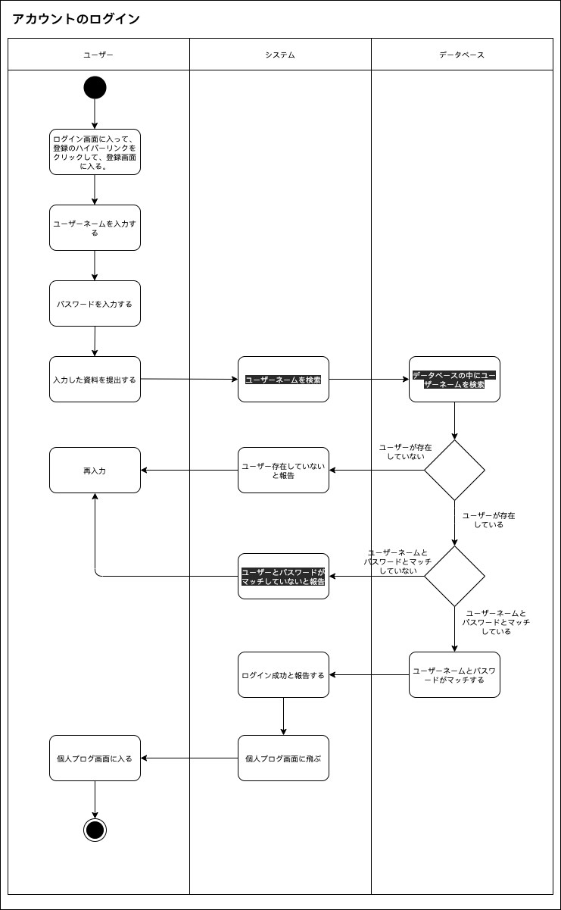

# MyBlogx

|日付|作業内容|備考|
|--|--|--|
|0818|設計図作成。|プロジェクトをし始める。|
|0819|クラス図の改善；login、register、newBlog、menu、blogのページのhtml、cssの部分内容の作成。|元々は三つのページを作るつもりだったけれども、進める途中で、さらに多くのページを作らなきゃと気づく。|
|0822|ページの数量を10枚までに補完（html、css部分）；フレームワークでサーバーとlogin、registerの基本ロジックの構築、ページをオンラインで調整。データベースのテーブルの作成。日報に備考のカラムを追加した。|フロントエンドでhtml、cssが完了した後、jsとjqueryとbootstrapはどうすればいいのかと考えた最後、まずサーバーでの調整と基本のロジックを完成しようと決めた。|
## ユースケース図

## クラス図

## アクティビティ図

